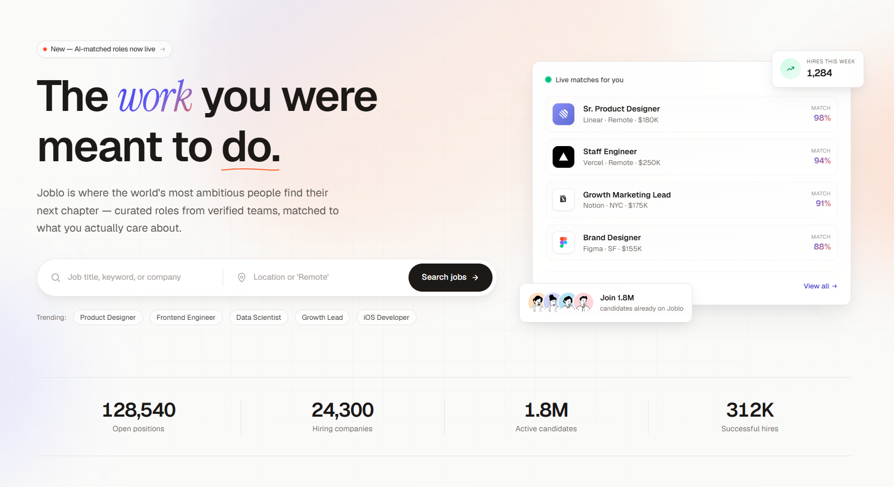

<h1 align="center">Joblo — Astro Job Marketplace Template</h1>

<p align="center">
  A premium 2026 job-marketplace Astro 7 template — two distinct homepages, full candidate + employer dashboards, verified companies, editorial blog, and structured-data SEO out of the box. Built on Tailwind CSS 4 with an auto-inverting ink token system, semantic tone map, and Instrument-Serif italic accents.
</p>

<p align="center">
  <a href="#features">Features</a> ·
  <a href="#pages">Pages</a> ·
  <a href="#getting-started">Getting Started</a> ·
  <a href="#customization">Customization</a> ·
  <a href="#project-structure">Project Structure</a> ·
  <a href="#tech-stack">Tech Stack</a> ·
  <a href="#license">License</a>
</p>

---

<p align="center">
  
</p>

---

## Features

- **149 static pages** — two homepages, 12-page candidate dashboard, 16-page employer dashboard, plus public marketing, blog, pricing, and auth flows.
- **Two complete home flavours** — Home 1 "Editorial bento" (Inter + Instrument Serif, brand indigo × accent coral, rich section cards) and Home 2 "List-driven" (compact card lists, cinematic video, minimal chrome) — each with its own header/footer.
- **Full candidate dashboard** — Overview, Applications, Interviews, Offers, **Assessments**, **Referrals**, Messages, Notifications, Saved jobs, Job alerts, Profile, Resume, Settings.
- **Full employer dashboard** — Overview, Manage jobs, Applicants (with detail page), Shortlisted, Interviews, **Scheduling**, **Assessments**, **Referrals**, Talent search, Talent pool, Analytics, Messages, Templates, Notifications, Company profile, Post-a-job, Billing, Settings.
- **Astro 7** static site framework with Rolldown bundler (~2× faster builds than Astro 5), file-based routing, JSON-LD schemas, sitemap, and RSS.
- **Tailwind CSS 4** via `@tailwindcss/vite` — every color, radius, and easing is a CSS custom property under `@theme`. No `tailwind.config.js`.
- **Auto-inverting ink scale** — 11-step `ink-50 → ink-950` tokens flip in dark mode automatically. Only always-light / always-dark surfaces need explicit `dark:!` overrides.
- **Semantic dark mode** — dark-first ready. Every section verified from 320 → 1920 px in both themes.
- **First-class SEO** — schema.org JSON-LD (`JobPosting`, `Organization`, `Article`, `Person`, `BreadcrumbList`) via `src/lib/schema.ts`, auto-generated sitemap-index (dashboard routes excluded), RSS feed, and per-page canonical + OG tags.
- **Rich mock data** — 24 jobs, 24 companies, 12 candidates, 15 applicants, 9 blog posts, threads, invoices, templates, hiring analytics.
- **Universal search** — a single `/search` page + wired header search modal + hero search on Home 1 / Home 2 — all filter the same real data with an 80 ms debounce.
- **Client-side pagination + filters** — Candidates directory (6/page), Blog category chips, Jobs status tabs, Applicants pipeline tabs, Referrals stage tabs — all no-reload.
- **Smooth accordion pattern** — every FAQ (Home 1, Home 2, Pricing, Contact, License, Blog details, Job details) uses the `grid-template-rows` transition with single-open behaviour and one always open.
- **Portfolio & gallery lightboxes** — case-study modal on candidate profiles, click-to-open gallery on company profiles, video-modal on Home 1/2 + About.
- **Fully responsive** — verified from 320 → 1920 px across every page in both themes.
- **Path aliases** (`@components`, `@layouts`, `@data`, `@lib`, `@types`) — no relative `../../` imports.
- **Zero runtime dependencies** — no client framework; every interaction is a small inline `<script>`.

---

## Pages

### Marketing

| Route | File | Description |
| --- | --- | --- |
| `/` | `src/pages/index.astro` | Home 1 — Editorial bento with 14 sections + video demo |
| `/home-2` | `src/pages/home-2.astro` | Home 2 — List-driven, cinematic video, 14 sections |
| `/about` | `src/pages/about.astro` | Story, milestones, values, team, offices, founder video |
| `/jobs` | `src/pages/jobs.astro` | Full job listing with filter sidebar |
| `/companies` | `src/pages/companies.astro` | Verified company directory |
| `/candidates` | `src/pages/candidates.astro` | Talent directory (paginated, 6/page) |
| `/categories` | `src/pages/categories.astro` | All hiring categories |
| `/blog` | `src/pages/blog.astro` | Editorial index — featured + category chips |
| `/pricing` | `src/pages/pricing.astro` | 3-tier plans + comparison table + FAQ |
| `/post-a-job` | `src/pages/post-a-job.astro` | Public employer form |
| `/contact` | `src/pages/contact.astro` | Contact form + support hours + FAQ |
| `/search` | `src/pages/search.astro` | Universal grouped search (jobs · companies · candidates · posts) |

### Detail (Dynamic Routes)

| Route | File | Description |
| --- | --- | --- |
| `/jobs/[slug]` | `src/pages/jobs/[slug].astro` | Job detail — tech stack · team · compensation · a-day-in-the-life · role FAQs · sticky apply sidebar |
| `/companies/[slug]` | `src/pages/companies/[slug].astro` | Company profile — hero · story · milestones · leadership · life-at · tech stack · gallery lightbox |
| `/candidates/[slug]` | `src/pages/candidates/[slug].astro` | Candidate profile — impact · portfolio (case-study modal) · education · looking-for · recommendation · languages |
| `/categories/[slug]` | `src/pages/categories/[slug].astro` | Category detail with live roles |
| `/blog/[slug]` | `src/pages/blog/[slug].astro` | Post — reading progress bar · key takeaways · mid-article CTA · FAQ · reader engagement |

### Candidate Dashboard

| Route | File | Description |
| --- | --- | --- |
| `/dashboard` | `src/pages/dashboard/index.astro` | Stats, next interviews, activity feed, recommended jobs |
| `/dashboard/applications` | `src/pages/dashboard/applications.astro` | Pipeline board + application table |
| `/dashboard/interviews` | `src/pages/dashboard/interviews.astro` | Upcoming rounds + prep checklist |
| `/dashboard/offers` | `src/pages/dashboard/offers.astro` | Compare and manage offer packages |
| `/dashboard/assessments` | `src/pages/dashboard/assessments.astro` | Assigned tests + progress + feedback |
| `/dashboard/referrals` | `src/pages/dashboard/referrals.astro` | Refer friends + bonus tracker |
| `/dashboard/messages` | `src/pages/dashboard/messages.astro` | Chats with hiring teams |
| `/dashboard/notifications` | `src/pages/dashboard/notifications.astro` | Full inbox with filters |
| `/dashboard/saved` | `src/pages/dashboard/saved.astro` | Bookmarked roles |
| `/dashboard/alerts` | `src/pages/dashboard/alerts.astro` | Auto-matched-role alerts |
| `/dashboard/profile` | `src/pages/dashboard/profile.astro` | Candidate profile view |
| `/dashboard/profile/edit` | `src/pages/dashboard/profile/edit.astro` | Profile edit form |
| `/dashboard/resume` | `src/pages/dashboard/resume.astro` | Template picker + live preview |
| `/dashboard/settings` | `src/pages/dashboard/settings.astro` | Account, notifications, privacy |

### Employer Dashboard

| Route | File | Description |
| --- | --- | --- |
| `/employer` | `src/pages/employer/index.astro` | Hiring funnel + KPIs + recent applicants |
| `/employer/jobs` | `src/pages/employer/jobs.astro` | Live, draft, and paused postings |
| `/employer/applicants` | `src/pages/employer/applicants/index.astro` | Pipeline view + review + rate |
| `/employer/applicants/[id]` | `src/pages/employer/applicants/[id].astro` | Applicant detail with feedback |
| `/employer/shortlisted` | `src/pages/employer/shortlisted.astro` | Candidates saved for a closer look |
| `/employer/interviews` | `src/pages/employer/interviews.astro` | Calendar + team availability |
| `/employer/scheduling` | `src/pages/employer/scheduling.astro` | Slot picker + booking links |
| `/employer/assessments` | `src/pages/employer/assessments.astro` | Test library + assign to candidates |
| `/employer/referrals` | `src/pages/employer/referrals.astro` | Referral pipeline + bonus program |
| `/employer/talent` | `src/pages/employer/talent.astro` | Proactive candidate discovery |
| `/employer/talent-pool` | `src/pages/employer/talent-pool.astro` | Long-term saved candidates |
| `/employer/analytics` | `src/pages/employer/analytics.astro` | Funnel, time-to-hire, source ROI |
| `/employer/messages` | `src/pages/employer/messages.astro` | Threaded chats with candidates |
| `/employer/templates` | `src/pages/employer/templates.astro` | Email, scorecards, offer letters |
| `/employer/notifications` | `src/pages/employer/notifications.astro` | Full activity center |
| `/employer/company` | `src/pages/employer/company.astro` | Public company page editor |
| `/employer/post-a-job` | `src/pages/employer/post-a-job.astro` | 5-step form to publish a role |
| `/employer/billing` | `src/pages/employer/billing.astro` | Plan, payment, and invoices |
| `/employer/settings` | `src/pages/employer/settings.astro` | Team, integrations, hiring prefs |

### Team

| Route | File | Description |
| --- | --- | --- |
| `/team/[slug]` | `src/pages/team/[slug].astro` | Team member profile — bio, projects, links |

### Account

| Route | File | Description |
| --- | --- | --- |
| `/login` | `src/pages/login.astro` | Split-screen sign in with editorial preview |
| `/register` | `src/pages/register.astro` | Create account with strength meter |
| `/forgot-password` | `src/pages/forgot-password.astro` | Send reset link |
| `/reset-password` | `src/pages/reset-password.astro` | New password + confirm + match hint |

### Template Info

| Route | File | Description |
| --- | --- | --- |
| `/style-guide` | `src/pages/style-guide.astro` | Living design system — tokens, type, buttons, forms, cards, icons |
| `/license` | `src/pages/license.astro` | Third-party asset credits + license reference |
| `/changelog` | `src/pages/changelog.astro` | Version-timeline (release notes, filter chips) |

### Utility

| Route | File | Description |
| --- | --- | --- |
| `/404` | `src/pages/404.astro` | Not Found with search + destinations |

---

## Getting Started

### Prerequisites

- **Node.js** >= 18.14.1 (Node 22+ recommended)
- **npm** (or yarn / pnpm)

### Install

```bash
npm install
```

### Development

```bash
npm run dev
# → http://localhost:4321
```

### Build

```bash
npm run build
# → dist/  (149 pages · sitemap-index.xml · rss.xml · robots.txt)
```

### Preview

```bash
npm run preview
```

### Type-check

```bash
npm run check
# runs `astro check` — TypeScript + template diagnostics
```

---

## Customization

### Site Identity and SEO

Open `src/data/site.ts` and update:

```ts
export const site = {
  name: "Joblo",
  legalName: "Joblo, Inc.",
  tagline: "The modern job marketplace.",
  description: "The marketplace that pairs 1.8M verified professionals with the teams building what's next.",
  url: "https://joblo.example.com",       // ← set your production domain
  location: { city: "San Francisco", country: "USA" },
  contact: { email: "hello@joblo.example.com", support: "support@joblo.example.com" },
  social: [ /* Twitter/X, LinkedIn, GitHub, Instagram */ ],
  stats: { jobs: "128,540", companies: "24,300", candidates: "1.8M", hires: "312K" },
} as const;
```

Also update the `site` URL in `astro.config.mjs` to match your production domain (required for sitemap, RSS, and canonical URLs).

### Colors and Typography

Design tokens live as CSS custom properties inside the `@theme` block of `src/styles/global.css`.

```css
@theme {
  /* Brand — indigo */
  --color-brand-500: #4a3fe6;
  --color-brand-600: #3d33c2;

  /* Accent — coral */
  --color-accent-500: #ff5a0a;

  /* Ink (auto-inverts in dark mode via .dark selector overrides) */
  --color-ink-50:  #fafaf9;   /* lightest in light mode → darkest in dark */
  --color-ink-900: #1c1917;   /* darkest in light mode → lightest in dark */

  /* Typography */
  --font-sans:    "Inter", ui-sans-serif, sans-serif;
  --font-display: "Instrument Serif", ui-serif, serif;
}
```

Because ink tokens auto-invert, `bg-ink-50` and `text-ink-900` work in both themes without a `dark:` override. Use explicit `dark:!` overrides only for surfaces that must stay light-on-dark (e.g. always-dark CTA cards).

> **Tailwind 4 arbitrary-value syntax:** wrap CSS variables — `bg-[var(--color-brand-500)]`, never `bg-[--color-brand-500]`.

### Page Content Data

All static content is typed TypeScript — edit the files in `src/data/`:

| File | Exports |
| --- | --- |
| `src/data/site.ts` | `site` — brand, contact, socials, stats |
| `src/data/navigation.ts` | `primaryNav`, `footerNav` — powers header dropdowns + mega menu + mobile drawer |
| `src/data/jobs.ts` | `jobs[]` — 24 seeded roles across categories |
| `src/data/jobContent.ts` | Per-job content (overview, responsibilities, requirements, benefits, hiring process) |
| `src/data/companies.ts` | `companies[]` — 24 verified employers with brand colors |
| `src/data/companyContent.ts` | Per-company content (story, mission, press, values, perks) |
| `src/data/candidates.ts` | `candidates[]` — 12 candidate profiles for the talent directory |
| `src/data/categories.ts` | `categories[]` — hiring category tiles with gradients |
| `src/data/locations.ts` | `locations[]` — cities + region metadata |
| `src/data/blog.ts` | `blogPosts[]`, `featuredBlogPosts`, `blogCategories` |
| `src/data/pricing.ts` | `plans[]`, `comparison`, `pricingFAQs` |
| `src/data/testimonials.ts` | `testimonials[]`, `liveHireAvatars` |
| `src/data/team.ts` | `team[]` — powers `/team/[slug]` details |
| `src/data/dashboard.ts` | `currentCandidate`, `applications`, `activity`, `dashboardStats`, `jobAlerts`, `savedJobs` |
| `src/data/employer.ts` | `currentEmployer`, `applicants`, `companyJobs`, `jobExtras`, `pipelineStages`, `employerStats` |

### Navigation and Mega Menus

`src/data/navigation.ts` controls every nav surface at once. Edit `primaryNav` to add/remove top-level links and dropdown children — both `Header.astro` (Home 1) and `Header2.astro` (Home 2) pick up the changes, including the mobile drawer. Icons on menu items are colour-tone-mapped via `iconTone` in `src/components/layout/Header.astro` — swap any icon there to change its chip colour.

### JSON-LD Schema

Schema helpers in `src/lib/schema.ts` — `jobPostingSchema`, `companyOrgSchema`, `articleSchema`, `personSchema`, `breadcrumbSchema`, `organizationSchema`, `websiteSchema`. Pages pass their schema arrays to `BaseLayout` which renders them as `<script type="application/ld+json">`.

### Images

External images load from `images.unsplash.com` and `api.dicebear.com` (avatars). To swap:

- Company brand logos → inline SVGs in `src/components/common/BrandLogo.astro` (replace before shipping — currently uses real brands for demo)
- Blog covers → `src/data/blog.ts`
- Team portraits → `src/data/team.ts` (DiceBear Notionists — deterministic seeds)
- Home 2 hero cover + city cards → `src/pages/about.astro` and `src/components/sections/home-2/`
- Video posters → `src/components/sections/VideoDemo.astro` + `src/components/sections/home-2/VideoDemo2.astro`

### Fonts

Loaded from Google Fonts inside `src/layouts/BaseLayout.astro` — Inter for UI, Instrument Serif for italic display accents. Swap the `<link>` tag and update `--font-sans` / `--font-display` in `src/styles/global.css`.

---

## Project Structure

```
joblo-astro/
├── public/
│   ├── favicon.svg
│   └── robots.txt
├── src/
│   ├── components/
│   │   ├── common/                # BrandLogo, CompanyMark, Logo
│   │   ├── companies/             # CompanyProfileHero, CompanyAbout, CompanyOpenRoles, CompanyTeam, SimilarCompanies
│   │   ├── dashboard/             # DashboardSidebar, DashboardTopbar, StatCard, StatusPill, DashboardCard
│   │   ├── employer/              # EmployerSidebar, EmployerTopbar, ApplicantStatusPill
│   │   ├── jobs/                  # JobCard, JobDetailsHeader, JobDetailsBody, JobDetailsSidebar, RelatedJobs, FilterSidebar, SearchBar, Pagination
│   │   ├── layout/                # Header, Header2, Footer, Footer2
│   │   ├── sections/              # 14 Home 1 sections (Hero, TrustedCompanies, Categories, FeaturedJobs, HowItWorks, VideoDemo, Testimonials, TopCompanies, FeaturedCandidates, JobsByLocation, RemoteJobs, MarketPulse, Insights, CandidateCTA, EmployerCTA, FAQ)
│   │   │   └── home-2/            # 14 Home 2 sections (Hero2, Categories2, FeaturedJobs2, HowItWorks2, VideoDemo2, Testimonials2, …, FAQ2)
│   │   └── ui/                    # Badge, Button, Container, EmptyState, Icon, LoadingState, Modal, SectionEyebrow, ThemeToggle, Table
│   ├── data/                      # Typed static content (site, navigation, jobs, companies, candidates, blog, pricing, dashboard, employer, …)
│   ├── layouts/
│   │   ├── BaseLayout.astro       # Marketing pages — Home 1 header + footer
│   │   ├── BaseLayout2.astro      # Marketing pages — Home 2 header + footer
│   │   ├── DashboardLayout.astro  # Candidate dashboard shell (sidebar + topbar)
│   │   ├── EmployerLayout.astro   # Employer dashboard shell (sidebar + topbar)
│   │   └── AuthLayout.astro       # Login / register / password with editorial right-side preview
│   ├── lib/
│   │   └── schema.ts              # JSON-LD schema generators
│   ├── pages/                     # File-based routing — 149 built pages including dynamics
│   ├── styles/
│   │   └── global.css             # @theme design tokens + auto-invert ink overrides + editorial font fixes
│   └── types/                     # Shared TypeScript interfaces
├── astro.config.mjs               # Astro + Tailwind Vite plugin + sitemap
├── tsconfig.json                  # Path aliases
├── LICENSE
└── package.json
```

---

## Tech Stack

| Package | Version | Purpose |
| --- | --- | --- |
| `astro` | ^7.3.1 | Static site framework, file-based routing (Rolldown bundler) |
| `tailwindcss` | ^4.3.3 | Utility-first CSS with `@theme` design tokens |
| `@tailwindcss/vite` | ^4.3.3 | Tailwind v4 Vite integration |
| `@astrojs/sitemap` | ^3.7.4 | Auto-generates `/sitemap-index.xml` (dashboard routes excluded) |
| `@astrojs/rss` | ^4.0.19 | RSS feed for the blog |
| `@astrojs/check` + `typescript` | ^0.9.4 / ^5.9.3 | Type + template diagnostics |

**Runtime:** Node.js >= 18.14.1 · **TypeScript:** strict mode · **Output:** fully static HTML · **Zero client framework**

---

## Available Scripts

| Command | Description |
| --- | --- |
| `npm run dev` | Start dev server at `http://localhost:4321` |
| `npm run build` | Build production site to `dist/` (also generates sitemap + RSS) |
| `npm run preview` | Preview the production build locally |
| `npm run check` | Run `astro check` — TypeScript + template validation |
| `npm run astro` | Run Astro CLI commands directly |

---

## Design System

A single design DNA that auto-inverts between light and dark themes. Every value lives in `src/styles/global.css`.

### Colors

| Token | Value | Notes |
| --- | --- | --- |
| `--color-brand-500` | `#4a3fe6` | Primary — indigo |
| `--color-accent-500` | `#ff5a0a` | Accent — coral |
| `--color-ink-50 … ink-950` | 11-step neutral scale | Auto-inverts in `.dark` |
| Semantic tones | emerald / amber / rose / sky / violet | Success · warning · danger · info · alt-brand |

### Typography

| Token | Value |
| --- | --- |
| `--font-sans` | Inter (UI, body, headings) |
| `--font-display` | Instrument Serif (italic accents — "the *work* you were meant to do") |

### Shared

| Token | Value |
| --- | --- |
| Container max-width | `xl` = 1280 px, `2xl` = 1400 px (custom via `Container.astro`) |
| Page gutter | `px-4 sm:px-6 lg:px-8` |
| Section vertical spacing | `py-16 sm:py-20 lg:py-28` typical |
| Radius | `rounded-2xl` (cards), `rounded-3xl` (hero + big cards), `rounded-full` (chips + buttons) |
| Breakpoints | Tailwind defaults — `sm` 640 / `md` 768 / `lg` 1024 / `xl` 1280 / `2xl` 1536 |

---

## Before You Ship

Quick pre-launch checklist for buyers:

- [ ] Update `site` in `astro.config.mjs` to your production URL.
- [ ] Update `src/data/site.ts` with your name, email, social handles, and stats.
- [ ] Replace `public/og-default.png` with your own 1200×630 social share image.
- [ ] Replace `public/favicon.svg` with your logo.
- [ ] Replace demo company logos + brand marks in `src/components/common/BrandLogo.astro` — they're real brands (Linear, Vercel, Figma, etc.) used for demo only.
- [ ] Swap the placeholder YouTube IDs in `VideoDemo.astro`, `VideoDemo2.astro`, and the About founder-video section for your own footage.
- [ ] Replace all mock data under `src/data/*.ts` with real content or wire to a CMS/API.
- [ ] Run `npm run build` and preview locally.
- [ ] Run through Lighthouse + axe DevTools for a11y and perf sanity.

---

## License

Commercial license — see [`LICENSE`](LICENSE) file (or the marketplace listing you purchased from). Third-party assets (Unsplash imagery, DiceBear avatars, Lucide-style icons, brand marks) retain their respective licences as documented on the [`/license`](src/pages/license.astro) page rendered in-app.

For questions, extensions, or support: `support@joblo.example.com`
